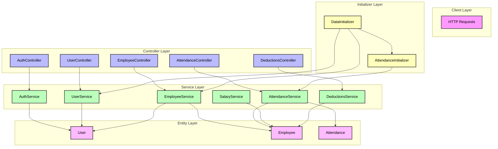
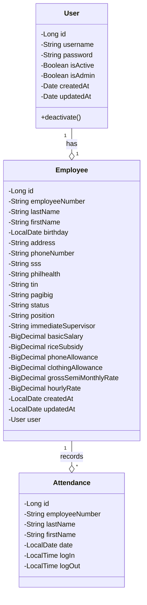
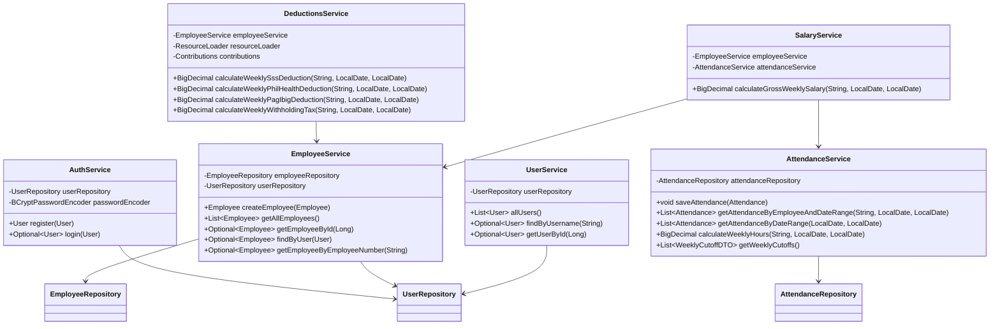
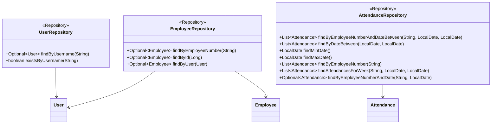
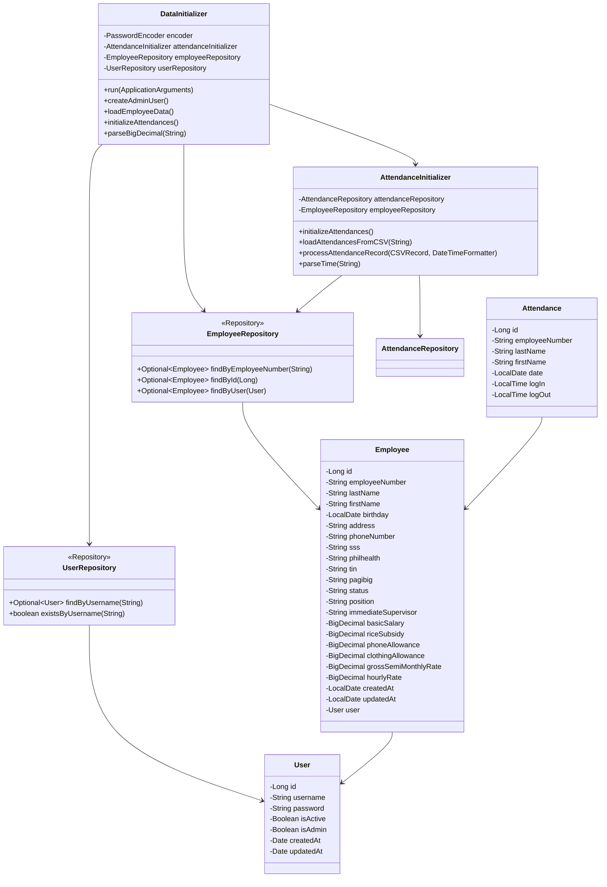

# cp2a

Homework #1: MotorPH Class Diagram

This backend REST API system is composed of multiple layers of components, classes, and even sub-classes, primarily designed to meet the [initial requirements outlined in Phase 1](https://sites.google.com/mmdc.mcl.edu.ph/motorph/home) of the CP1 project. These include the basic presentation of employee details and the automatic calculation of salaries based on hours worked and standard deductions.

This architecture ensures clean separation of concerns, maintainable code, and clear responsibility boundaries between components.

## Overview of the Application Layers:

| **Layer**             | **Purpose**       | **Key Components**                                                                                       | **Responsibilities**                                                                                                                                          |
| --------------------- | ----------------- | -------------------------------------------------------------------------------------------------------- | ------------------------------------------------------------------------------------------------------------------------------------------------------------- |
| **Entity Layer**      | Data Modeling     | `User`, `Employee`, `Attendance`                                                                         | • Defines data structures • Maps entities using JPA annotations • Manages relationships • Applies validation rules                                   |
| **Service Layer**     | Business Logic    | `UserService`, `EmployeeService`, `AttendanceService`, `SalaryService`, `DeductionsService`              | • Implements core business rules • Performs complex calculations • Manages transactions • Coordinates data flow between layers                       |
| **Controller Layer**  | API Entry Point   | `UserController`, `EmployeeController`, `AttendanceController`, `DeductionsController`, `AuthController` | • Handles HTTP requests and responses • Manages authentication and session logic • Processes and formats API responses • Delegates tasks to services |
| **Initializer Layer** | Application Setup | `DataInitializer`, `AttendanceInitializer`                                                               | • Loads initial and sample data • Sets up default admin accounts • Imports data from CSV files • Ensures correct initialization sequence             |

### Key Elements in Architectural Diagram

### Color Coding

- Pink: Client layer (HTTP requests)
- Blue: Controller layer (REST endpoints)
- Green: Service layer (business logic)
- Purple: Entity layer (data model)
- Yellow: Initializer layer (data setup)

### Layer Relationships

The arrows in the diagram represent dependencies and data flow:

- Downward arrows show dependencies (e.g., controllers depend on services)
- Upward arrows show data flow (e.g., services return data to controllers)
- The initializer layer operates independently but depends on services to perform its tasks

### Key Architectural Features

1. **Layer Separation** - Each layer has a specific responsibility

- Clear boundaries between layers
- Single direction of dependencies (top-down)

2. **Component Organization** - Related components are grouped within layers

- Each controller has a corresponding service
- Services can depend on multiple entities
- Initializers coordinate with services for data setup

3. **Data Flow** - HTTP requests enter through controllers

- Controllers delegate to appropriate services
- Services interact with entities for data persistence
- Initializers use services to set up initial data

## Entities

This diagram provides a clear overview of your payroll system's core structure from [CP 1 project](https://github.com/imperionite/cp1) that will eventually adopted to the current project with CP 2, showing how Users, Employees, and Attendance records are related. The relationships shown here will help you understand how data flows through your system and how different components interact.

### Relationship Notation

- The diamond symbol (o) indicates composition/aggregation, meaning one class "owns" or "contains" the other
- The numbers "1" and "\*" show multiplicity: - "1" means exactly one instance
- "\*" means many instances

- For example, "User '1' --o '1' Employee" means one User has exactly one Employee
- "Employee '1' --o '\*' Attendance" means one Employee can have many Attendance records

### Visibility Modifiers

- Minus (-) indicates private members (attributes)
- Plus (+) indicates public members (methods)

### Class Structure

- Each class is shown with three sections: - Class name at the top
  - Attributes (fields) in the middle
  - Methods at the bottom

## Services

The service layer provides a solid foundation for the system, handling all business logic while keeping the code organized and maintainable.

### Notation Explanation

- Arrows (-->) indicate dependencies between components
- Tilde notation (~) in return types (e.g., `List~User~`) represents generic types
- Each service class shows its dependencies (repositories) and key methods

### Service Layer Structure

Your services are organized into distinct responsibilities:

1. **User Management** - UserService handles basic user operations

- AuthService manages authentication and security

2. **Employee Management** - EmployeeService manages employee data and relationships

- Depends on both EmployeeRepository and UserRepository

3. **Attendance Tracking** - AttendanceService handles attendance records

- Includes complex calculations for weekly hours

4. **Payroll Processing** - SalaryService calculates gross weekly salary

- DeductionsService handles all types of deductions (SSS, PhilHealth, Pag-Ibig, Tax)

## Controllers

The controller layer provides a complete REST API interface for the system, handling all HTTP requests and responses while maintaining proper security and separation of concerns.

```mermaid
classDiagram
    class UserController {
        -UserService userService
        +getCurrentUser(@AuthenticationPrincipal UserDetails)
        +allUsers(@AuthenticationPrincipal UserDetails)
    }

    class EmployeeController {
        -EmployeeService employeeService
        -UserService userService
        +createEmployee(@RequestBody Employee, @AuthenticationPrincipal UserDetails)
        +getAllEmployees(@AuthenticationPrincipal UserDetails)
        +getEmployeeById(@PathVariable Long, @AuthenticationPrincipal UserDetails)
        +getBasicInfoByEmployeeNumber(@PathVariable String, @AuthenticationPrincipal UserDetails)
        +getMyDetails(@AuthenticationPrincipal UserDetails)
    }

    class AttendanceController {
        -EmployeeService employeeService
        -AttendanceService attendanceService
        +createAttendance(@RequestBody AttendanceRequest, @AuthenticationPrincipal UserDetails)
        +getWeeklyCutoffs(@AuthenticationPrincipal UserDetails)
        +getAttendanceByEmployeeAndDateRange(@PathVariable String, @RequestParam LocalDate, @RequestParam LocalDate)
        +calculateWeeklyHours(@PathVariable String, @RequestParam LocalDate, @RequestParam LocalDate)
    }

    class DeductionsController {
        -DeductionsService deductionsService
        +calculateWeeklySssDeduction(@AuthenticationPrincipal UserDetails, @RequestParam String, @RequestParam LocalDate, @RequestParam LocalDate)
        +calculateWeeklyPhilHealthDeduction(@AuthenticationPrincipal UserDetails, @RequestParam String, @RequestParam LocalDate, @RequestParam LocalDate)
        +calculateWeeklyPagIbigDeduction(@AuthenticationPrincipal UserDetails, @RequestParam String, @RequestParam LocalDate, @RequestParam LocalDate)
        +calculateWeeklyWithholdingTax(@AuthenticationPrincipal UserDetails, @RequestParam LocalDate, @RequestParam LocalDate, @RequestParam String)
    }

    class AuthController {
        -AuthService authService
        -JwtTokenProvider jwtTokenProvider
        -UserService userService
        +register(@Valid @RequestBody User, @AuthenticationPrincipal UserDetails)
        +login(@RequestBody User)
    }

    UserController --> UserService
    EmployeeController --> EmployeeService
    EmployeeController --> UserService
    AttendanceController --> EmployeeService
    AttendanceController --> AttendanceService
    DeductionsController --> DeductionsService
    AuthController --> AuthService
    AuthController --> UserService
    AuthController --> JwtTokenProvider

```

### Notation Explanation

- Arrows (-->) indicate dependencies between components
- Each controller class shows its dependencies (services) and key methods
- Parameters with @ symbols (e.g., `@AuthenticationPrincipal`) are Spring annotations

### Controller Layer Structure

Your controllers are organized into distinct responsibilities:

1. **User Management** - UserController handles user-related operations

- Manages user authentication and basic user information

2. **Employee Management** - EmployeeController manages employee data and operations

- Depends on both EmployeeService and UserService
- Handles employee CRUD operations and basic information retrieval

3. **Attendance Tracking** - AttendanceController handles attendance records

- Manages attendance creation and retrieval
- Calculates weekly hours
- Provides weekly cutoff information

4. **Deductions Processing** - DeductionsController handles all types of deductions

- Calculates SSS, PhilHealth, Pag-Ibig, and withholding tax
- Provides detailed deduction calculations

5. **Authentication** - AuthController manages user authentication

- Handles registration and login operations
- Generates JWT tokens for authenticated users

## Repositories

The repository layer provides a solid foundation for the system's data access layer, handling all database operations while maintaining clean separation from your business logic.

### Notation Explanation

- The `<<Repository>>` stereotype indicates these are Spring Data JPA repository interfaces
- Arrows (-->) show dependencies between repositories and their corresponding entities
- Tilde notation (~) in return types (e.g., `Optional~User~`) represents generic types
- Each repository extends `JpaRepository<T, ID>` where T is the entity type and ID is the primary key type

### Repository Layer Structure

Your repositories are organized to handle data access for each entity:

1. **UserRepository** - Handles basic user data access

- Provides methods for finding users by username
- Includes existence check for usernames

2. **EmployeeRepository** - Manages employee data access

- Provides methods for finding employees by: - Employee number

  - ID
  - Associated user

- Shows relationship with User entity through `findByUser` method

3. **AttendanceRepository** - Handles attendance record management

- Provides comprehensive query methods for: - Date range filtering
  - Employee-specific attendance
  - Date boundary queries (min/max dates)
  - Weekly attendance calculations
- Uses JPQL queries for complex operations

## Initializers

The initialization layer provides a robust way to populate database with initial data while maintaining proper separation of concerns and following Spring Boot best practices.

### Notation Explanation

- The `<<Repository>>` stereotype indicates Spring Data JPA repository interfaces
- Arrows (-->) show dependencies between components
- Each class shows its key methods and dependencies
- The diagram includes all related entities (Employee, User, Attendance) to show complete relationships

### Initialization Flow

The diagram shows two main initializer classes:

1. **DataInitializer** - Primary initializer that runs first (Order = 1)

- Depends on both UserRepository and EmployeeRepository
- Coordinates the initialization process through three main steps: - Creates admin user if none exists
  - Loads employee data from CSV
  - Initializes attendance data through AttendanceInitializer

2. **AttendanceInitializer** - Secondary initializer that handles attendance data

- Depends on AttendanceRepository and EmployeeRepository
- Processes attendance records from CSV files
- Called by DataInitializer after employee data is loaded

### Key Relationships

- DataInitializer manages the overall initialization process and coordinates with AttendanceInitializer
- Both initializers work with repositories to persist data
- Repositories handle CRUD operations for their respective entities
- Entities maintain their relationships (Employee has a User, Attendance belongs to an Employee)
