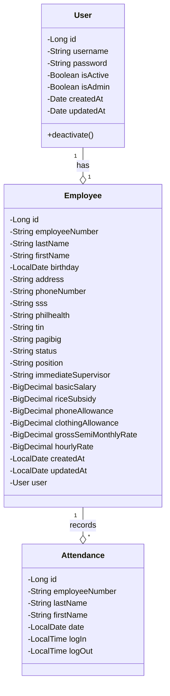

# cp2a

Homework #1: MotorPH Employee App Implementation

## Entities

This diagram provides a clear overview of your payroll system's core structure from [CP 1 project](https://github.com/imperionite/cp1) that will eventually adopted to the current project with CP 2, showing how Users, Employees, and Attendance records are related. The relationships shown here will help you understand how data flows through your system and how different components interact.

### Relationship Notation

- The diamond symbol (o) indicates composition/aggregation, meaning one class "owns" or "contains" the other
- The numbers "1" and "*" show multiplicity:
          - "1" means exactly one instance
- "*" means many instances

- For example, "User '1' --o '1' Employee" means one User has exactly one Employee
- "Employee '1' --o '*' Attendance" means one Employee can have many Attendance records

### Visibility Modifiers

- Minus (-) indicates private members (attributes)
- Plus (+) indicates public members (methods)

### Class Structure

- Each class is shown with three sections:
          - Class name at the top
  - Attributes (fields) in the middle
  - Methods at the bottom

