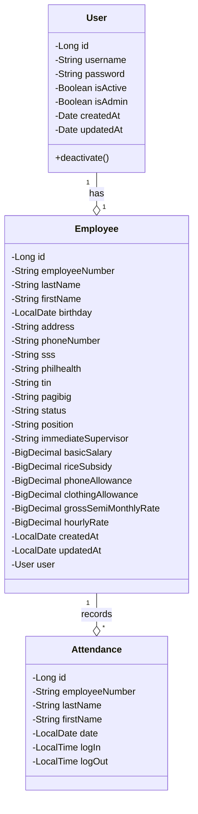

# cp2a

Homework #1: MotorPH Class Diagram

This backend REST API system is composed of multiple layers of components, classes, and even sub-classes, primarily designed to meet the [initial requirements outlined in Phase 1](https://sites.google.com/mmdc.mcl.edu.ph/motorph/home) of the CP1 project. These include the basic presentation of employee details and the automatic calculation of salaries based on hours worked and standard deductions.

## Entities

This diagram provides a clear overview of your payroll system's core structure from [CP 1 project](https://github.com/imperionite/cp1) that will eventually adopted to the current project with CP 2, showing how Users, Employees, and Attendance records are related. The relationships shown here will help you understand how data flows through your system and how different components interact.

### Relationship Notation

- The diamond symbol (o) indicates composition/aggregation, meaning one class "owns" or "contains" the other
- The numbers "1" and "\*" show multiplicity: - "1" means exactly one instance
- "\*" means many instances

- For example, "User '1' --o '1' Employee" means one User has exactly one Employee
- "Employee '1' --o '\*' Attendance" means one Employee can have many Attendance records

### Visibility Modifiers

- Minus (-) indicates private members (attributes)
- Plus (+) indicates public members (methods)

### Class Structure

- Each class is shown with three sections: - Class name at the top
  - Attributes (fields) in the middle
  - Methods at the bottom

## Services

The service layer provides a solid foundation for the system, handling all business logic while keeping the code organized and maintainable.

### Notation Explanation

- Arrows (-->) indicate dependencies between components
- Tilde notation (~) in return types (e.g., `List~User~`) represents generic types
- Each service class shows its dependencies (repositories) and key methods

### Service Layer Structure

Your services are organized into distinct responsibilities:

1. **User Management**  - UserService handles basic user operations
  - AuthService manages authentication and security

2. **Employee Management**  - EmployeeService manages employee data and relationships
  - Depends on both EmployeeRepository and UserRepository

3. **Attendance Tracking**  - AttendanceService handles attendance records
  - Includes complex calculations for weekly hours

4. **Payroll Processing**  - SalaryService calculates gross weekly salary
  - DeductionsService handles all types of deductions (SSS, PhilHealth, Pag-Ibig, Tax)

## Controllers

The controller layer provides a complete REST API interface for your payroll system, handling all HTTP requests and responses while maintaining proper security and separation of concerns.

### Notation Explanation

- Arrows (-->) indicate dependencies between components
- Each controller class shows its dependencies (services) and key methods
- Parameters with @ symbols (e.g., `@AuthenticationPrincipal`) are Spring annotations

### Controller Layer Structure

Your controllers are organized into distinct responsibilities:

1. **User Management**  - UserController handles user-related operations
  - Manages user authentication and basic user information

2. **Employee Management**  - EmployeeController manages employee data and operations
  - Depends on both EmployeeService and UserService
  - Handles employee CRUD operations and basic information retrieval

3. **Attendance Tracking**  - AttendanceController handles attendance records
  - Manages attendance creation and retrieval
  - Calculates weekly hours
  - Provides weekly cutoff information

4. **Deductions Processing**  - DeductionsController handles all types of deductions
  - Calculates SSS, PhilHealth, Pag-Ibig, and withholding tax
  - Provides detailed deduction calculations

5. **Authentication**  - AuthController manages user authentication
  - Handles registration and login operations
  - Generates JWT tokens for authenticated users

